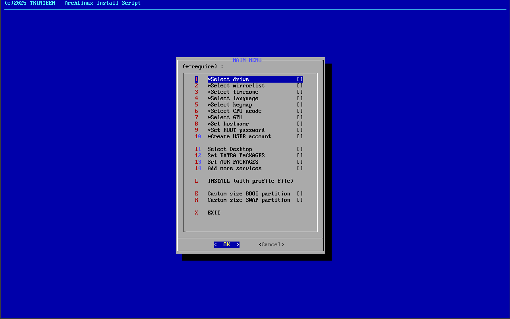

# My Archlinux install script



# HW configuration:
UEFI Only, BIOS/MBR/Legacy not supported

Program install as:
- Bootloader: Systemd-Boot
- GUI Installer: dialog


# Get script:

2) Update pacman.key
```
pacman-key --init
```

2) Install Git:
```
pacman -Sy git
```

3) Clone github repo:
```
git clone https://github.com/trinteen/archinstall
```

4) Enter to directory:
```
cd archinstall
```

5) Run
```
sh start.sh
```